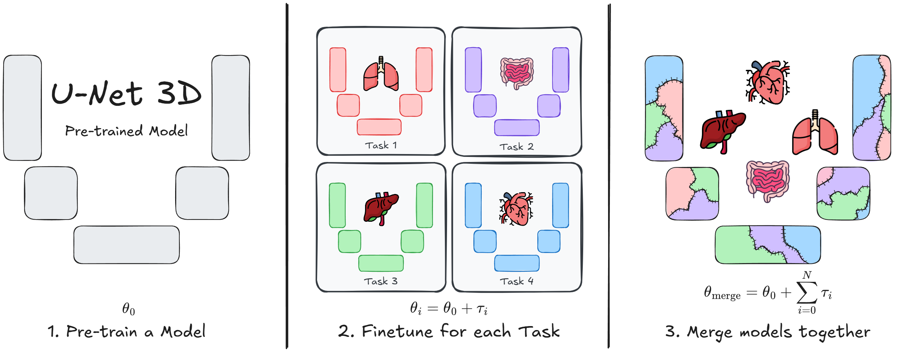

# U-Net Transplant: Model Merging for 3D Medical Segmentation  


This repository contains the implementation of **U-Net Transplant**, a framework for efficient model merging in 3D medical image segmentation. Model merging enables the combination of specialized segmentation models without requiring full retraining, offering a flexible and privacy-conscious solution for updating AI models in clinical applications.  

Our approach leverages **task vectors** and encourages **wide minima** during pre-training to enhance the effectiveness of model merging. We evaluate this method using the **ToothFairy2** and **BTCV Abdomen** datasets with a standard **3D U-Net** architecture, demonstrating its ability to integrate multiple specialized segmentation tasks into a single model.  


# Pretrain and Task Vector Checkpoints
The related checkpoints and task vectors used in the paper will be available from the 23rd June 2025.


# How to Run

### 1. Clone the Repository  
```bash
git clone <REAL_GITHUB_URL_HERE>
cd UNetTransplant
```

### 2. Setup Environment
```bash
python -m venv env
source env/bin/activate  # On Windows: env\Scripts\activate
pip install -r requirements.txt
```

### 3. Download and Prepare Datasets  
Ensure the datasets are downloaded and organized following the nnUNet dataset format.

- **BTCV Abdomen**: [Download Here](https://www.synapse.org/Synapse:syn3193805/wiki/217753)  
- **ToothFairy2**: [Download Here](https://ditto.ing.unimore.it/toothfairy2/)  
- **AMOS**: [Download Here](https://zenodo.org/records/7262581)  
- **ZhimingCui**: Available upon request from the authors ([Paper](https://www.nature.com/articles/s41467-022-29637-2))

### 4. Running the U-Net Transplant Framework

The main script for running experiments is `main.py`. It requires specifying the type of experiment and a configuration file that defines dataset, model, optimizer, and training parameters.

#### Command Structure
```bash
python main.py --experiment <EXPERIMENT_TYPE> --config <CONFIG_PATH> [--expname <NAME>] [--override <PARAMS>]
```

#### Arguments
- **`--experiment`**: Specifies the type of experiment to run.  
  - `"PretrainExperiment"` → Pretrains the model from scratch.  
  - `"TaskVectorTrainExperiment"` → Trains a task vector using a pretrained checkpoint.  

- **`--config`**: Path to the configuration file, which defines dataset, model, and training settings.  

- **`--expname`** (optional): Custom experiment name. If not provided, the config filename is used.  

- **`--override`** (optional): Allows overriding config values at runtime. Example:  
  ```bash
  python main.py --experiment PretrainExperiment --config configs/default.yaml --override DataConfig.BATCH_SIZE=4 OptimizerConfig.LR=0.01
  ```

#### Configuration File (`config.yaml`)
The configuration file defines:
- **Dataset** (`DataConfig`): Path, batch size, patch size, and datasets used.  
- **Model** (`BackboneConfig` & `HeadsConfig`): Architecture, checkpoints, and initialization.  
- **Optimizer** (`OptimizerConfig`): Learning rates, weight decay, and momentum.  
- **Loss Function** (`LossConfig`): Defines the loss function used.  
- **Training** (`TrainConfig`): Number of epochs, checkpoint saving, and resume options.  

#### Example Configuration
```yaml
DataConfig:
  NAME: "ComposedDataset"
  DATASET_NAMES: ["AMOS"]
  BATCH_SIZE: 4
  DATA_PREPROCESSED_PATH: "/path/to/preprocessed_data"
  DATA_RAW_PATH: "/path/to/raw_data"

BackboneConfig:
  NAME: "ResidualUNet3D"

OptimizerConfig:
  NAME: "AdamW"
  LR: 0.001
  WEIGHT_DECAY: 0.1

TrainConfig:
  EPOCHS: 101
  SAVE_EVERY: 10
```

#### Example Commands
1. **Pretraining a model**:
   ```bash
   python main.py --experiment PretrainExperiment --config configs/pretrain.yaml
   ```
2. **Training a task vector from a checkpoint**:
   ```bash
   python main.py --experiment TaskVectorTrainExperiment --config configs/task_vector.yaml --override BackboneConfig.PRETRAIN_CHECKPOINTS="path/to/checkpoint.pth"
   ```

For further details, refer to the config files used in our experiments under the `configs` folder.

